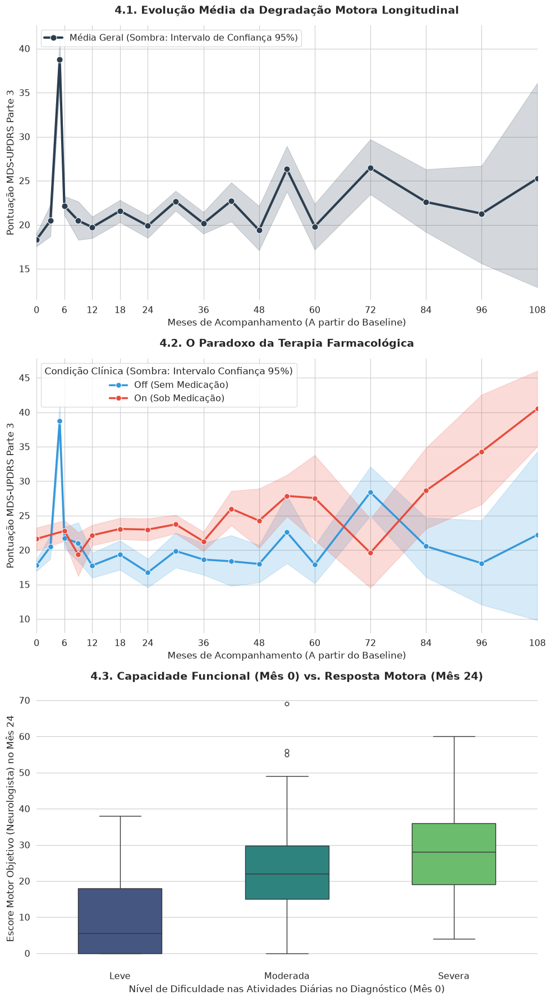
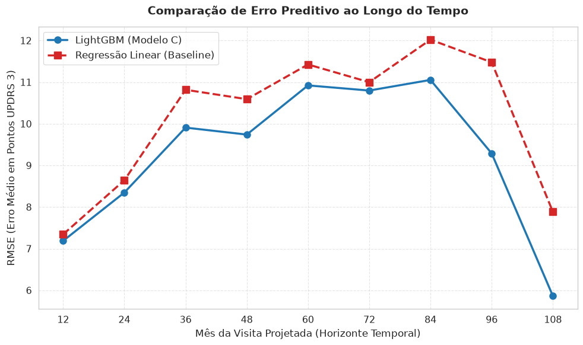

# 🧠 Predição Longitudinal de Degradação Motora na Doença de Parkinson

<p align="left">
  
  
  
  
</p>

## 📌 Visão Geral do Projeto

Este projeto desenvolve um **Sistema de Suporte à Decisão Clínica (CDSS)** impulsionado por Machine Learning para projetar a trajetória de degradação motora de pacientes com Doença de Parkinson.

O foco central é a modelagem da escala **MDS-UPDRS Parte 3** (Exame Motor) ao longo de um horizonte prospectivo de até 120 meses. Além da modelagem preditiva, este estudo realiza um teste de hipótese rigoroso para avaliar o **custo-benefício clínico** da inclusão de marcadores proteômicos de alto custo versus modelos fundamentados exclusivamente em histórico clínico de consultório.


*(Gráfico ilustrando a progressão motora e os intervalos de confiança capturados no estudo)*

### 🚀 A Aplicação (Gêmeo Digital Clínico)
O modelo final foi encapsulado em uma aplicação interativa construída com **Streamlit**, permitindo que profissionais de saúde simulem cenários farmacológicos e visualizem a curva de progressão do paciente com intervalos de confiança dinâmicos.

---

## 🗄️ Fonte dos Dados e Reprodutibilidade

Os dados clínicos e moleculares utilizados neste estudo provêm da iniciativa **AMP-PD (Accelerated Medicines Partnership® Parkinson's Disease)**.

Para facilitar a reprodutibilidade técnica e o acesso aberto à pesquisa, este projeto utiliza o recorte de dados disponibilizado publicamente na competição do Kaggle **"AMP®-Parkinson's Disease Progression Prediction"**.

> **Como obter os dados:** Para reproduzir este pipeline localmente, baixe os arquivos originais da competição diretamente do [Kaggle](https://www.kaggle.com/competitions/amp-parkinsons-disease-progression-prediction/data) e insira-os na pasta `data/` na raiz deste repositório.

---

## 🔬 Metodologia e Rigor Científico

A modelagem de dados de saúde longitudinais exige salvaguardas extremas. O pipeline foi estruturado focado em integridade metodológica e prevenção de vieses:

* **Prevenção de Data Leakage:** Todas as variáveis preditoras (baseline) foram rigorosamente isoladas no Mês 0. Variáveis dependentes de eventos futuros não programados (como meses de retorno atípicos) foram descartadas para simular o "Dia 1" realista em um consultório.
* **Correção de Viés Observacional (O Paradoxo da Medicação):** O algoritmo foi treinado para interpretar a intervenção farmacológica (`medication_on`) com cautela, visto que, em dados observacionais reais, a medicação atua como uma forte *proxy* de severidade clínica aguda.
* **Engenharia de Features:** Criação de derivadas não-lineares, como a *Razão Motor-Funcional* (Escore Motor / Impacto nas Atividades Diárias), capturando diferentes fenótipos de progressão sistêmica.
* **Validação Cruzada Cega (GroupKFold):** Agrupamento rigoroso por `patient_id`. O modelo de *Gradient Boosting* (LightGBM) foi avaliado estritamente em pacientes inéditos (Out-of-Fold), garantindo a generalização do erro.

---

## 📊 Resultados e Teste de Hipótese

Uma etapa crítica do projeto foi testar a eficácia da matriz proteômica (espectrometria de massas no LCR/Plasma) em relação aos dados puramente clínicos.

* **Hipótese:** A adição da assinatura proteômica de alta dimensão reduz o erro absoluto do modelo?
* **Teste Estatístico:** Teste Pareado de Wilcoxon sobre os erros residuais de ambos os modelos.
* **Conclusão:** O teste retornou um P-Valor que **falhou em rejeitar a Hipótese Nula (H0)**. Provou-se que não há evidências estatísticas significativas de que a proteômica basal melhore o poder preditivo para o declínio *motor* de longo prazo neste cenário.

Com a eficácia da abordagem clínica validada, o modelo final obteve uma grande vantagem de **escalabilidade**, alcançando um desempenho robusto na coorte expandida:
> **Métricas Finais (Out-of-Fold):** RMSE = 9.15 pontos | SMAPE = 46.50%



---

## 🛠️ Como Executar o Projeto Localmente

1. **Clone o repositório:**
```bash
git clone [https://github.com/SEU-USUARIO/parkinson-predictive-model.git](https://github.com/SEU-USUARIO/parkinson-predictive-model.git)
cd parkinson-predictive-model
```

2. **Faça o download dos dados:**
Baixe os arquivos `.csv` (como `train_clinical_data.csv`, `train_peptides.csv`, etc.) diretamente da [competição do Kaggle](https://www.kaggle.com/competitions/amp-parkinsons-disease-progression-prediction/data) e coloque-os dentro da pasta `data/`.

3. **Instale as dependências:**
```bash
pip install -r requirements.txt
```

4. **Execute o Simulador (Streamlit):**
```bash
cd app
streamlit run app.py
```